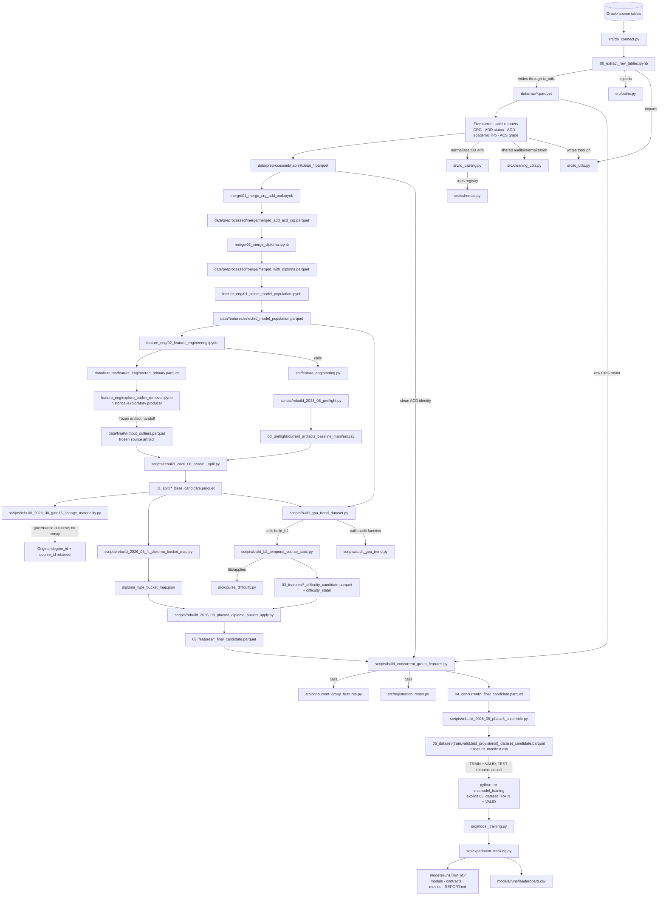

# Academic Advisor project pipeline and report lineage

This note is the visual companion to [[docs/manifests/codebase_map_2026-08.md|the complete `src/` and `scripts/` census]] and [[docs/manifests/models_runs_index_2026-08.md|the model-run index]]. It maps the checkable route from Oracle extraction to model artifacts, then maps each report back to the script that writes it.

> [!important] How to read this map
> - A solid arrow is a current data flow, import, or script-to-script call.
> - A dashed arrow ending at a document is a report/output written by that script.
> - The dashed feature-to-outlier route is a frozen artifact handoff: the August rebuild reads the artifact, but its producing notebook is not a current rebuild entry point.
> - The 2026-08 controlled training route reads TRAIN and VALID explicitly. It builds a provisional TEST dataset but does not read TEST outcomes during training.
> - “Current” means reachable from an audited entry point, not merely suggested by a filename or docstring.

## End-to-end current route

The first merge consumes the cleaned CRG, ADD student-degree-status, and ACD degree-course tables. The second adds the cleaned academic-info/diploma table. The cleaned ACS-grade table is part of the maintained cleaning surface, but no edge from it into the current merge/training route was confirmed.

## Maintained notebook generation route

This is the default generation used by the training notebook. It is separate from the versioned 2026-08 rebuild route above.

```mermaid
flowchart LR
    SOURCE["data/final/without_outliers.parquet"]
    SPLITNB["model_eng/01_split_diagnostics.ipynb"]
    BASE["data/model_data/df_{train,valid,test}_base.parquet"]
    DIFFNB["model_eng/02_course_difficulty.ipynb"]
    DIFF["data/model_data/df_{train,valid,test}_difficulty.parquet"]
    BUCKETNB["model_eng/03_diploma_type_bucketing.ipynb"]
    FINAL["data/model_data/df_{train,valid,test}_final.parquet"]
    TRAINNB["training_notebooks/01_train_lightgbm.ipynb"]
    TRAIN["python -m src.model_training"]

    SOURCE --> SPLITNB --> BASE --> DIFFNB --> DIFF --> BUCKETNB --> FINAL --> TRAINNB --> TRAIN
```

> [!note] Two training entrances, one trainer
> `01_train_lightgbm.ipynb` invokes `src.model_training` against the maintained `data/model_data/df_*_final.parquet` defaults. The controlled August runs invoke the same module as a CLI with explicit versioned `05_dataset` TRAIN/VALID paths. Both converge on `src/model_training.py` and `src/experiment_tracking.py`.

## Current report inheritance

Solid arrows below mean “calls or consumes.” Dashed arrows mean “writes this report.” A child report therefore sits under the script that actually creates it, not under a similarly named phase.

```mermaid
flowchart TD
    P0["rebuild_2026_08_preflight.py"] -. writes .-> P0R["00_preflight/preflight_report.md<br/>preflight_environment.json<br/>two manifest CSVs"]

    P1["rebuild_2026_08_phase1_split.py"] -. writes .-> P1R["01_split/split_summary.json<br/>chronology, count, coverage, exclusion, duplicate CSVs"]
    P1 --> P1N["rebuild_2026_08_phase1_reports.py"]
    P1N -. writes .-> P1NR["source_dataset_inspection.md<br/>old_boundary_reproduction_report.md<br/>temporal_split_report.md"]

    G15["rebuild_2026_08_gate15_lineage_materiality.py"] -. writes .-> G15R["01_5_lineage_gate/lineage_materiality_gate.json<br/>lineage_materiality_rows.csv<br/>lineage_materiality_report.md"]

    GPA["build_gpa_trend_dataset.py"] -->|calls| B2["build_b2_temporal_course_stats.py"]
    GPA -->|calls function from| AG["audit_gpa_trend.py"]
    GPA -. writes .-> GPAR["03_features/gpa_trend_build_report.json"]
    B2 -. writes .-> B2R["03_features/b2_data_report.json<br/>03_features/REPORT.md"]
    AG -. writes .-> AGR["03_features/gpa_trend_audit/gpa_trend_audit.json<br/>GPA_TREND_AUDIT.md"]

    DA["rebuild_2026_08_phase3_diploma_bucket_apply.py"] -. writes .-> DAR["03_features/diploma_bucket_apply_report.json"]
    CG["build_concurrent_group_features.py"] -. writes .-> CGR["04_concurrent/phase7_registration_roster_report.json<br/>PHASE7_REGISTRATION_ROSTER_REPORT.md<br/>SHA256SUMS.txt"]
    AS["rebuild_2026_08_phase3_assemble.py"] -. writes .-> ASR["05_dataset/phase3_dataset_report.json<br/>feature_manifest.csv"]

    MT["src/model_training.py"] --> ET["src/experiment_tracking.py"]
    ET -. writes .-> RR["models/runs/{run_id}/REPORT.md<br/>metrics.json + feature_contract.json<br/>models/runs/leaderboard.csv"]
```

### Experiment and diagnostic report lineage

```mermaid
flowchart TD
    B41["generate_multiseed_baseline41_vs_concurrent44_report.py"] -. writes .-> B41R["MULTISEED_BASELINE41_VS_CONCURRENT44_REPORT.{json,md}"]

    C43["generate_multiseed_concurrent43_vs_concurrent44_report.py"] -->|calls| VERIFY["verify_concurrent_43_vs_concurrent_44.py"]
    C43 -. writes .-> C43R["MULTISEED_CONCURRENT43_VS_CONCURRENT44_REPORT.{json,md}"]
    VERIFY -. writes .-> VERIFYR["CONCURRENT43_VS_CONCURRENT44_VERIFICATION.json"]

    REG["generate_regularization_screening_report.py"] -. writes .-> REGR["REGULARIZATION_SCREENING_SEED42_REPORT.{json,md}"]

    R2GEN["generate_r2_confirmation_report.py"] -->|imports check| R2P["r2_parity.py<br/>returns checks; no own artifact"]
    R2GEN -. writes .-> R2R["R2_CONFIRMATION_5SEED_REPORT.{json,md}"]
    R2COV["r2_coverage_rescore.py"] -->|imports check| R2P
    R2COV -. writes .-> R2CR["R2_COVERED_UNCOVERED_FIVE_SEED_REPORT.{json,md}"]

    DC["difficulty_coverage_diagnostic.py"] -. writes .-> DCR["DIFFICULTY_COVERAGE_DIAGNOSTIC.{json,md}"]
    ID["audit_id_columns.py"] -. writes .-> IDR["data/audit/id_dtype_audit/<br/>id_columns_audit.{csv,json} + id_columns_summary.md"]
    FT["diagnose_failure_thresholds.py"] -. writes .-> FTR["models/diagnostics/{timestamp}__failure-threshold-sweep/<br/>three CSVs + REPORT.md"]
    MF["diagnose_missed_failures.py"] -. writes .-> MFR["models/diagnostics/{timestamp}__missed-fail-analysis/<br/>CSV + two JSONs + REPORT.md"]
```

## Stage-to-file navigation

| Stage | Entry point or owner | Direct support | Main output |
|---|---|---|---|
| Extract | [[note_books/pre_processing/00_extract_raw_tables.ipynb|00_extract_raw_tables.ipynb]] | [[src/db_connect.py|db_connect]], [[src/paths.py|paths]], [[src/io_utils.py|io_utils]] | `data/raw/*.parquet` |
| Clean IDs/tables | Numbered notebooks below `note_books/pre_processing/` | [[src/id_casting.py|id_casting]], [[src/schemas.py|schemas]], [[src/cleaning_utils.py|cleaning_utils]], [[src/io_utils.py|io_utils]] | `data/preprocessed/<table>/clean_*.parquet` |
| Merge CRG + ADD + ACD | [[note_books/merge/01_merge_crg_add_acd.ipynb|01_merge_crg_add_acd.ipynb]] | [[src/paths.py|paths]], [[src/io_utils.py|io_utils]] | `data/preprocessed/merge/merged_add_acd_crg.parquet` |
| Merge diploma | [[note_books/merge/02_merge_diploma.ipynb|02_merge_diploma.ipynb]] | [[src/paths.py|paths]], [[src/io_utils.py|io_utils]] | `data/preprocessed/merge/merged_with_diploma.parquet` |
| Select population | [[note_books/feature_eng/01_select_model_population.ipynb|01_select_model_population.ipynb]] | [[src/paths.py|paths]], [[src/io_utils.py|io_utils]] | `data/features/selected_model_population.parquet` |
| Primary features | [[note_books/feature_eng/02_feature_engineering.ipynb|02_feature_engineering.ipynb]] | [[src/feature_engineering.py|feature_engineering]], [[src/paths.py|paths]], [[src/io_utils.py|io_utils]] | `data/features/feature_engineered_primary.parquet` |
| Frozen source handoff | [[note_books/feature_eng/explore_outlier_removal.ipynb|explore_outlier_removal.ipynb]] | historical/exploratory producer | `data/final/without_outliers.parquet` |
| August preflight | [[scripts/rebuild_2026_08_preflight.py|rebuild_2026_08_preflight.py]] | [[src/paths.py|paths]], [[src/rebuild_paths.py|rebuild_paths]] | `00_preflight/*` |
| August split | [[scripts/rebuild_2026_08_phase1_split.py|rebuild_2026_08_phase1_split.py]] | [[src/paths.py|paths]], [[src/rebuild_paths.py|rebuild_paths]] | `01_split/*_base_candidate.parquet` |
| Phase-1 narratives | [[scripts/rebuild_2026_08_phase1_reports.py|rebuild_2026_08_phase1_reports.py]] | consumes the Phase-1 split summary, chronology CSV, and frozen reference artifacts | three `01_split/*.md` reports |
| Lineage gate | [[scripts/rebuild_2026_08_gate15_lineage_materiality.py|rebuild_2026_08_gate15_lineage_materiality.py]] | [[src/course_difficulty.py|course_difficulty]] | `01_5_lineage_gate/*`; original IDs continue |
| Diploma-map fit | [[scripts/rebuild_2026_08_fit_diploma_bucket_map.py|rebuild_2026_08_fit_diploma_bucket_map.py]] | [[src/diploma_bucketing.py|diploma_bucketing]], [[src/rebuild_paths.py|rebuild_paths]] | version-local `diploma_type_bucket_map.json` |
| GPA trend + temporal difficulty | [[scripts/build_gpa_trend_dataset.py|build_gpa_trend_dataset.py]] | calls [[scripts/build_b2_temporal_course_stats.py|build_b2_temporal_course_stats.py]] and [[scripts/audit_gpa_trend.py|audit_gpa_trend.py]]; uses [[src/feature_engineering.py|feature_engineering]] and [[src/course_difficulty.py|course_difficulty]] | `03_features/*_difficulty_candidate.parquet`, difficulty state, audits |
| Diploma-map apply | [[scripts/rebuild_2026_08_phase3_diploma_bucket_apply.py|rebuild_2026_08_phase3_diploma_bucket_apply.py]] | [[src/diploma_bucketing.py|diploma_bucketing]], [[src/rebuild_paths.py|rebuild_paths]] | `03_features/*_final_candidate.parquet` |
| Concurrent roster/features | [[scripts/build_concurrent_group_features.py|build_concurrent_group_features.py]] | [[src/concurrent_group_features.py|concurrent_group_features]], [[src/registration_roster.py|registration_roster]], [[src/cleaning_utils.py|cleaning_utils]], [[src/feature_engineering.py|feature_engineering]] | `04_concurrent/*_{concurrent,final}_candidate.parquet` |
| Assemble contracts | [[scripts/rebuild_2026_08_phase3_assemble.py|rebuild_2026_08_phase3_assemble.py]] | [[src/concurrent_group_features.py|concurrent_group_features]], [[src/course_difficulty.py|course_difficulty]], [[src/rebuild_paths.py|rebuild_paths]] | `05_dataset/*_dataset_candidate.parquet`, manifest, report |
| Train and record | [[src/model_training.py|model_training.py]]; notebook entrance [[note_books/training_notebooks/01_train_lightgbm.ipynb|01_train_lightgbm.ipynb]] | [[src/experiment_tracking.py|experiment_tracking]], [[src/feature_engineering.py|feature_engineering]], [[src/paths.py|paths]], implicit [[src/__init__.py|package init]] | `models/runs/<run_id>/*`, `leaderboard.csv` |

## Files deliberately outside the current training route

These files still belong in the project map, but connecting them to the current training line would incorrectly imply reachability.

### Report-only and diagnostic tools

- [[scripts/audit_id_columns.py|audit_id_columns.py]]
- [[scripts/diagnose_failure_thresholds.py|diagnose_failure_thresholds.py]]
- [[scripts/diagnose_missed_failures.py|diagnose_missed_failures.py]]
- [[scripts/difficulty_coverage_diagnostic.py|difficulty_coverage_diagnostic.py]]
- [[scripts/generate_multiseed_baseline41_vs_concurrent44_report.py|generate_multiseed_baseline41_vs_concurrent44_report.py]]
- [[scripts/generate_multiseed_concurrent43_vs_concurrent44_report.py|generate_multiseed_concurrent43_vs_concurrent44_report.py]]
- [[scripts/generate_r2_confirmation_report.py|generate_r2_confirmation_report.py]]
- [[scripts/generate_regularization_screening_report.py|generate_regularization_screening_report.py]]
- [[scripts/r2_coverage_rescore.py|r2_coverage_rescore.py]], supported by [[scripts/r2_parity.py|r2_parity.py]]
- [[scripts/verify_concurrent_43_vs_concurrent_44.py|verify_concurrent_43_vs_concurrent_44.py]]

### Closed historical branches

| Closed branch | Files | Why it is not connected to current training |
|---|---|---|
| Course-identity investigation | [[scripts/course_identity_diagnostic.py|course_identity_diagnostic.py]], [[scripts/course_identity_investigation.py|course_identity_investigation.py]], [[scripts/course_identity_reconciliation_2025.py|course_identity_reconciliation_2025.py]], [[scripts/course_identity_67_degree_verification.py|course_identity_67_degree_verification.py]] | Produced candidate/review evidence only; no canonical IDs were authorised. |
| Phase 0–2 lineage mapping | [[scripts/phase0_evidence_recovery.py|phase0_evidence_recovery.py]], [[scripts/phase1_name_key_layer.py|phase1_name_key_layer.py]], [[scripts/phase2_mapping_tables.py|phase2_mapping_tables.py]], [[scripts/phase2_mapping_tables_train_membership.py|phase2_mapping_tables_train_membership.py]], [[scripts/phase2_mapping_tables_scope_fix.py|phase2_mapping_tables_scope_fix.py]], [[scripts/phase2_link_corrections.py|phase2_link_corrections.py]] | `Decisions_Log.md` records `phase_2_decision = NOT_AUTHORISED_BY_OWNER_DESPITE_PROCEED`; the rebuild retains original IDs. |
| Predecessor-prior pilot | [[scripts/phase3_predecessor_prior_pilot_build.py|pilot build]], [[scripts/phase3_predecessor_prior_pilot_evaluate.py|pilot evaluate]], [[scripts/phase3_predecessor_prior_pilot_report.py|pilot report]] | Closed pilot with a recorded harmful/non-authorised verdict; its data and ten run directories are not promoted. |
| Governance/migration utilities | [[scripts/migrate_legacy_baseline.py|migrate_legacy_baseline.py]], [[scripts/parity_check.py|parity_check.py]] | One-time migration and completed freeze-parity work, not pipeline entry points. |
| Retired in-place merge | [[src/merge_diploma.py|merge_diploma.py]] | Raises unconditionally before imports or I/O; the maintained owner is `merge/02_merge_diploma.ipynb`. |

### No confirmed current caller

- [[scripts/Diagnose concurrent group v2.py|Diagnose concurrent group v2.py]] — executable diagnostic, but no caller/importer found.
- [[scripts/show_leaderboard.py|show_leaderboard.py]] — prints `leaderboard.csv`, but no caller/importer found.
- [[src/explain.md|src/explain.md]] — unreferenced prose walkthrough.
- [[src/inference.py|inference.py]], [[src/knn_advisor.py|knn_advisor.py]], and [[src/recommendation.py|recommendation.py]] — form a plausible post-training recommendation stack, but only call one another/tests; no current pipeline entry point reaches them and KNN remains on governance HOLD.

## Evidence anchors and guardrails

- Extraction imports are in `00_extract_raw_tables.ipynb` cell 2; its save cells write the raw parquet files.
- The maintained training notebook invokes `python -m src.model_training`; the audited codebase map records this as cell 6 because notebook cell numbering excludes non-code cells, while the raw JSON code-cell index is 10.
- `build_gpa_trend_dataset.py:234` calls `build_b2(...)`; lines 269–275 call `create_semester_audit_report(...)` from `audit_gpa_trend.py`.
- `build_concurrent_group_features.py:1982-2009` writes the JSON report, Markdown report, and checksum file.
- `rebuild_2026_08_phase3_assemble.py:347-445` reads concurrent-final splits and writes the three model-facing datasets, feature manifest, and dataset report. Its report records `test_outcomes_read: false` and `model_trained: false`.
- `src/experiment_tracking.py:324-360` writes per-run `REPORT.md` and appends `models/runs/leaderboard.csv`.
- The complete one-row-per-source evidence, reads, writes, and last commits remain in [[docs/manifests/codebase_map_2026-08.md|codebase_map_2026-08]].
