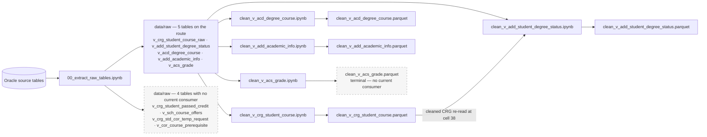

# Stage 1 — extraction and table cleaning

Oracle → `data/raw/*.parquet` → the five table cleaners → `data/preprocessed/<table>/clean_*.parquet`.

> [!important] How to read the diagram
> - A **solid** arrow is a current data flow, import, or script-to-script call.
> - A **dashed** arrow ending at a document is a report or output written by that script.
> - "Current" means reachable from an audited entry point, not merely suggested by a filename or docstring.

## Route

Each cleaner reads exactly the one raw table its name refers to, and writes exactly the one cleaned table its name refers to. The single exception to that 1:1 shape is the edge drawn above: `clean_v_add_student_degree_status.ipynb` also re-reads the **cleaned** CRG output, so the two cleaners are order-dependent.

Four of the nine extracted tables have no consumer on the current route — they are read only by the `explore_*` notebooks beside them, or by nothing at all. `clean_v_acs_grade.parquet` is produced and then read only by `note_books/archive/all.ipynb`, so the ACS branch is maintained but terminal.

## Stage-to-file navigation

| Step                            | Entry point or owner                                                                            | Direct support                                                                    | Main output                                                                               |
| ------------------------------- | ----------------------------------------------------------------------------------------------- | --------------------------------------------------------------------------------- | ----------------------------------------------------------------------------------------- |
| Extract                         | `note_books/pre_processing/00_extract_raw_tables.ipynb`                                         | `src/db_connect.py`, `src/paths.py`, `src/io_utils.py`                            | 9 × `data/raw/*.parquet`                                                                  |
| Clean CRG student course        | `note_books/pre_processing/V_CRG_STUDENT_COURSE/clean_v_crg_student_course.ipynb`               | `src/id_casting.py`, `src/schemas.py`, `src/cleaning_utils.py`, `src/io_utils.py` | `data/preprocessed/V_CRG_STUDENT_COURSE/clean_v_crg_student_course.parquet`               |
| Clean ADD student degree status | `note_books/pre_processing/V_ADD_STUDENT_DEGREE_STATUS/clean_v_add_student_degree_status.ipynb` | same, plus the cleaned CRG table                                                  | `data/preprocessed/V_ADD_STUDENT_DEGREE_STATUS/clean_v_add_student_degree_status.parquet` |
| Clean ACD degree course         | `note_books/pre_processing/V_ACD_DEGREE_COURSE/clean_v_acd_degree_course.ipynb`                 | same                                                                              | `data/preprocessed/V_ACD_DEGREE_COURSE/clean_v_acd_degree_course.parquet`                 |
| Clean ADD academic info         | `note_books/pre_processing/V_ADD_ACADEMIC_INFO/clean_v_add_academic_info.ipynb`                 | same                                                                              | `data/preprocessed/V_ADD_ACADEMIC_INFO/clean_v_add_academic_info.parquet`                 |
| Clean ACS grade                 | `note_books/pre_processing/V_ACS_GRADE/clean_v_acs_grade.ipynb`                                 | same                                                                              | `data/preprocessed/V_ACS_GRADE/clean_v_acs_grade.parquet`                                 |

## Reports produced by this stage

None. No script or notebook in this stage writes a markdown or JSON report. The ID-column audit under `data/audit/id_dtype_audit/` is written by `scripts/audit_id_columns.py`, which is a report-only tool and is not part of this route — see `05-off-route`.

## Evidence anchors

- `00_extract_raw_tables.ipynb` raw cell index 2 imports `RAW_DIR` and `assert_data_root` from `src/paths.py`, `save_parquet` from `src/io_utils.py`, and `get_connection` from `src/db_connect.py`, then calls `assert_data_root()` before opening the connection — the governance contract 12 guard.
- The same notebook's raw cell indices 5–14 each call `save_parquet(df, RAW_DIR / "<table>.parquet")`; that is where the nine raw table names above come from.
- `src/db_connect.py:16-25` — `get_connection()` returns `oracledb.connect(...)` from module-level credential globals.
- `src/io_utils.py:8-27` — `ensure_parent_dir()` creates the parent, then `save_parquet()` calls `df.to_parquet(output_path, index=index, **kwargs)`.
- `normalize_ids` is imported from `src/id_casting.py` at raw cell index 1 (ACD), 4 (ACS), 0 (academic info), 2 (ADD status), and 3 (CRG); it is applied at cells 11, 13, 11, 8, and 19 respectively.
- `src/id_casting.py:13` imports the per-table rule registry from `src/schemas.py`.
- Cleaner write cells: ACD 15, ACS 37, academic info 12, ADD status 46, CRG 63 — each a single `save_parquet(...)` into `PREPROCESSED_DIR / "<TABLE>" / "clean_*.parquet"`.
- The cross-dependency is `clean_v_add_student_degree_status.ipynb` cell 38, which reads `PREPROCESSED_DIR / "V_CRG_STUDENT_COURSE" / "clean_v_crg_student_course.parquet"`.
- The four unconsumed raw tables were checked by repo-wide grep across `src/`, `scripts/`, and `note_books/`: each returns only the extraction notebook and, for three of them, a sibling `explore_*` notebook. `v_cor_course_prerequisite` returns the extraction notebook only.
- `clean_v_acs_grade.parquet` grep returns only its own producing notebook and `note_books/archive/all.ipynb`.

---

Next: [[02-merge-and-features]] · Per-file detail: [[codebase_map_2026-08]]
