# Stage 2 — merges, population select, and feature engineering

Cleaned tables → both merges → population select → primary feature engineering → the frozen `without_outliers.parquet` handoff that every later stage starts from.

> [!important] How to read the diagram
> - A **solid** arrow is a current data flow, import, or script-to-script call.
> - A **dashed** arrow ending at a document is a report or output written by that script.
> - The dashed handoff into the frozen artifact is deliberate: the artifact is current, but its producing notebook is exploratory and is not a rebuild entry point.

## Route

```mermaid
flowchart LR
    CLEANIN["Cleaned tables from stage 1<br/>CRG · ADD status · ACD"]
    CLEANACAD["clean_v_add_academic_info.parquet"]
    RAWIN["data/raw — re-read directly<br/>v_add_student_degree_status · v_crg_student_course_raw"]

    MERGE1["merge/01_merge_crg_add_acd.ipynb"]
    CRGADD["merge/merge_crg_add.parquet<br/>intermediate — no current consumer"]
    MERGED1["merge/merged_add_acd_crg.parquet"]
    MERGE2["merge/02_merge_diploma.ipynb"]
    MERGED2["merge/merged_with_diploma.parquet"]

    SELECT["feature_eng/01_select_model_population.ipynb"]
    SELECTED["features/selected_model_population.parquet"]
    FE["feature_eng/02_feature_engineering.ipynb"]
    PRIMARY["features/feature_engineered_primary.parquet"]
    OUTLIER["feature_eng/explore_outlier_removal.ipynb<br/>exploratory producer"]
    FROZEN["final/without_outliers.parquet<br/>frozen source artifact"]

    CLEANIN --> MERGE1
    MERGE1 --> CRGADD
    MERGE1 --> MERGED1
    MERGED1 --> MERGE2
    CLEANACAD --> MERGE2 --> MERGED2
    MERGED2 --> SELECT
    RAWIN --> SELECT
    SELECT --> SELECTED --> FE --> PRIMARY
    PRIMARY -.-> OUTLIER
    OUTLIER -.->|"frozen artifact handoff"| FROZEN

    classDef dead fill:#f6f6f6,stroke:#999999,stroke-dasharray: 5 5;
    class CRGADD dead;
```

Two things in this diagram are easy to get wrong from filenames alone.

`01_merge_crg_add_acd.ipynb` writes **two** parquet artifacts, not one. `merge_crg_add.parquet` is the intermediate CRG+ADD join; the notebook then adds ACD and writes `merged_add_acd_crg.parquet`, which is the artifact the next stage consumes. The intermediate is referenced today only by `scripts/parity_check.py`, a closed governance tool, so it is a terminal node on the current route.

`01_select_model_population.ipynb` does not draw only from the merge chain. It also re-reads two **raw** tables directly, bypassing their cleaned counterparts.

## Stage-to-file navigation

| Step | Entry point or owner | Direct support | Main output |
|---|---|---|---|
| Merge CRG + ADD + ACD | `note_books/merge/01_merge_crg_add_acd.ipynb` | `src/paths.py`, `src/io_utils.py` | `data/preprocessed/merge/merge_crg_add.parquet`, `data/preprocessed/merge/merged_add_acd_crg.parquet` |
| Merge diploma | `note_books/merge/02_merge_diploma.ipynb` | `src/paths.py`, `src/io_utils.py` | `data/preprocessed/merge/merged_with_diploma.parquet` |
| Select population | `note_books/feature_eng/01_select_model_population.ipynb` | `src/paths.py`, `src/io_utils.py` | `data/features/selected_model_population.parquet` |
| Primary features | `note_books/feature_eng/02_feature_engineering.ipynb` | `src/feature_engineering.py`, `src/paths.py`, `src/io_utils.py` | `data/features/feature_engineered_primary.parquet` |
| Frozen source handoff | `note_books/feature_eng/explore_outlier_removal.ipynb` | exploratory producer, not a rebuild entry point | `data/final/without_outliers.parquet` |

## Reports produced by this stage

| Producer | Writes |
|---|---|
| `note_books/merge/01_merge_crg_add_acd.ipynb` | `data/preprocessed/merge/merge_crg_add_unmatched_add_snapshot.csv` — an unmatched-rows audit snapshot, not a markdown report |

No other step in this stage writes a report artifact.

## Evidence anchors

- `01_merge_crg_add_acd.ipynb` cell 2 defines the input and output paths; cell 3 reads the cleaned CRG, cleaned ADD status, and cleaned ACD tables; cell 12 writes `merge_crg_add.parquet`; cell 21 writes `MERGE_DIR / "merged_add_acd_crg.parquet"`.
- Repo-wide grep for `merge_crg_add.parquet` returns only that notebook and `scripts/parity_check.py`, which is classed `HISTORICAL` — hence the terminal marking.
- `02_merge_diploma.ipynb` cell 1 defines paths; cell 2 reads the cleaned academic-info table; cell 7 reads `merged_add_acd_crg.parquet`; cell 10 writes `merged_with_diploma.parquet`.
- `src/merge_diploma.py` is **not** the owner of this step. It raises `RuntimeError` at line 12, before any import or I/O, under governance decision D1; the maintained owner is `note_books/merge/02_merge_diploma.ipynb`.
- `01_select_model_population.ipynb` cell 3 reads `merged_with_diploma.parquet`; cell 52 reads `RAW_DIR / "v_add_student_degree_status.parquet"`; cell 60 reads `RAW_DIR / "v_crg_student_course_raw.parquet"`; cell 62 writes `FEATURES_DIR / "selected_model_population.parquet"`.
- `02_feature_engineering.ipynb` cell 4 reads the selected population; cell 24 writes `FEATURE_ENGINEERED_PRIMARY_PATH`. It calls into `src/feature_engineering.py`, which is `SUPPORT` — it holds no file paths of its own and operates on in-memory frames.
- `explore_outlier_removal.ipynb` cells 3–4 read `feature_engineered_primary.parquet`; cell 15 writes `FINAL_DIR / "without_outliers.parquet"`.

---

Previous: [[01-extract-and-clean]] · Next: [[03-rebuild-2026-08]] · Per-file detail: [[codebase_map_2026-08]]

