# Stage 3 — the 2026-08 temporal rebuild

`without_outliers.parquet` → preflight → temporal split → lineage gate → diploma map → GPA trend and B2 difficulty → concurrent peer features → `05_dataset`.

Everything below is version-local under
`data/model_data/versions/2026-08_temporal_rebuild_v1/`. Stage directory names in this document are relative to that root.

> [!important] How to read the diagram
> - A **solid** arrow is a current data flow, import, or script-to-script call.
> - A **dashed** arrow ending at a document is a report or output written by that script.
> - Reports are omitted from the flow diagram to keep it readable; they are listed in full in the report table below.

## Route

```mermaid
flowchart LR
    FROZEN["final/without_outliers.parquet"]
    SELECTED["features/selected_model_population.parquet"]

    subgraph P0["Preflight and split"]
        PREFLIGHT["rebuild_2026_08_preflight.py"]
        PFMAN["00_preflight/current_artifacts_baseline_manifest.csv"]
        SPLIT["rebuild_2026_08_phase1_split.py"]
        BASE["01_split/*_base_candidate.parquet"]
        GATE["rebuild_2026_08_gate15_lineage_materiality.py"]
    end

    subgraph P3["Features"]
        FITMAP["rebuild_2026_08_fit_diploma_bucket_map.py"]
        MAP["diploma_type_bucket_map.json"]
        GPA["build_gpa_trend_dataset.py"]
        B2["build_b2_temporal_course_stats.py"]
        DIFF["03_features/*_difficulty_candidate.parquet<br/>+ difficulty_state/"]
        APPLY["rebuild_2026_08_phase3_diploma_bucket_apply.py"]
        FINAL3["03_features/*_final_candidate.parquet"]
    end

    subgraph P7["Concurrent and assembly"]
        CONC["build_concurrent_group_features.py"]
        CONC4["04_concurrent/*_final_candidate.parquet<br/>+ registration_roster_*.parquet"]
        ASSEMBLE["rebuild_2026_08_phase3_assemble.py"]
        DATASET5["05_dataset/{train,valid,test_provisional}_dataset_candidate.parquet"]
    end

    FROZEN --> SPLIT
    PREFLIGHT --> PFMAN --> SPLIT --> BASE
    BASE --> GATE
    GATE -->|"original degree_id + course_id retained"| FITMAP
    BASE --> FITMAP --> MAP
    BASE --> GPA
    SELECTED --> GPA
    GPA -->|"calls build_b2"| B2 --> DIFF
    MAP --> APPLY
    DIFF --> APPLY --> FINAL3
    FINAL3 --> CONC --> CONC4 --> ASSEMBLE --> DATASET5
```

The version tree has no `02_` stage directory — the numbering runs `00_preflight`, `01_split`, `01_5_lineage_gate`, `03_features`, `04_concurrent`, `05_dataset`. The gap is where Phase 2 lineage remapping would have sat. It was not authorised, so no artifact was produced and the original identifiers pass through untouched.

`build_gpa_trend_dataset.py` is the orchestrator for the feature phase: it calls the B2 builder in-process rather than the two being run separately, and it calls the GPA-trend audit the same way.

`build_concurrent_group_features.py` also reads outside this version tree — it takes the raw CRG roster from `data/raw/` and the cleaned ACD identity table from `data/preprocessed/`, alongside the version-local difficulty state.

## Stage-to-file navigation

| Step | Entry point or owner | Direct support | Main output |
|---|---|---|---|
| Preflight | `scripts/rebuild_2026_08_preflight.py` | `src/paths.py`, `src/rebuild_paths.py` | `00_preflight/*` |
| Temporal split | `scripts/rebuild_2026_08_phase1_split.py` | `src/paths.py`, `src/rebuild_paths.py` | `01_split/*_base_candidate.parquet` plus coverage, exclusion, and duplicate CSVs |
| Phase-1 narratives | `scripts/rebuild_2026_08_phase1_reports.py` | consumes the Phase-1 split summary, the chronology CSV, and frozen reference artifacts | three `01_split/*.md` reports |
| Lineage gate | `scripts/rebuild_2026_08_gate15_lineage_materiality.py` | `src/course_difficulty.py` | `01_5_lineage_gate/*`; original IDs continue |
| Diploma-map fit | `scripts/rebuild_2026_08_fit_diploma_bucket_map.py` | `src/diploma_bucketing.py`, `src/rebuild_paths.py` | version-local `diploma_type_bucket_map.json` |
| GPA trend + temporal difficulty | `scripts/build_gpa_trend_dataset.py`, which calls `scripts/build_b2_temporal_course_stats.py` and `scripts/audit_gpa_trend.py` | `src/feature_engineering.py`, `src/course_difficulty.py` | `03_features/*_difficulty_candidate.parquet`, `03_features/difficulty_state/`, audits |
| Diploma-map apply | `scripts/rebuild_2026_08_phase3_diploma_bucket_apply.py` | `src/diploma_bucketing.py`, `src/rebuild_paths.py` | `03_features/*_final_candidate.parquet` |
| Concurrent roster/features | `scripts/build_concurrent_group_features.py` | `src/concurrent_group_features.py`, `src/registration_roster.py`, `src/cleaning_utils.py`, `src/feature_engineering.py` | `04_concurrent/*_{concurrent,final}_candidate.parquet` |
| Assemble contracts | `scripts/rebuild_2026_08_phase3_assemble.py` | `src/concurrent_group_features.py`, `src/course_difficulty.py`, `src/rebuild_paths.py` | `05_dataset/*_dataset_candidate.parquet`, feature manifest, dataset report |

## Reports produced by this stage

| Producer | Writes |
|---|---|
| `scripts/rebuild_2026_08_preflight.py` | `00_preflight/preflight_report.md`, `preflight_environment.json`, `current_artifacts_baseline_manifest.csv`, `pinned_version_constants.csv` |
| `scripts/rebuild_2026_08_phase1_split.py` | `01_split/split_summary.json` plus the chronology, row-count, coverage, exclusion, and duplicate CSVs |
| `scripts/rebuild_2026_08_phase1_reports.py` | `01_split/source_dataset_inspection.md`, `old_boundary_reproduction_report.md`, `temporal_split_report.md` |
| `scripts/rebuild_2026_08_gate15_lineage_materiality.py` | `01_5_lineage_gate/lineage_materiality_gate.json`, `lineage_materiality_rows.csv`, `lineage_materiality_report.md` |
| `scripts/build_gpa_trend_dataset.py` | `03_features/gpa_trend_build_report.json` |
| `scripts/build_b2_temporal_course_stats.py` | `03_features/b2_data_report.json`, `03_features/REPORT.md` |
| `scripts/audit_gpa_trend.py` — called as a function, not run standalone | `03_features/gpa_trend_audit/gpa_trend_audit.json`, `GPA_TREND_AUDIT.md` |
| `scripts/rebuild_2026_08_phase3_diploma_bucket_apply.py` | `03_features/diploma_bucket_apply_report.json` |
| `scripts/build_concurrent_group_features.py` | `04_concurrent/phase7_registration_roster_report.json`, `PHASE7_REGISTRATION_ROSTER_REPORT.md`, `SHA256SUMS.txt` |
| `scripts/rebuild_2026_08_phase3_assemble.py` | `05_dataset/phase3_dataset_report.json`, `05_dataset/feature_manifest.csv` |

One file in `00_preflight/` is **not** in this table because nothing in the repository writes it — see `05-off-route`.

## Evidence anchors

- `build_gpa_trend_dataset.py:234` calls `build_b2(...)`; lines 269–275 call `create_semester_audit_report(...)` from `scripts/audit_gpa_trend.py`.
- `build_concurrent_group_features.py:1982-2009` writes `phase7_registration_roster_report.json`, `PHASE7_REGISTRATION_ROSTER_REPORT.md`, and `SHA256SUMS.txt`.
- `rebuild_2026_08_phase3_assemble.py:347-350` resolves its inputs through `rebuild_split_path(root, split, "final", stage="concurrent", must_exist=True)`; lines 439–445 write `phase3_dataset_report.json`.
- That report records the stage's own governance state: `test_outcomes_read = false`, `model_trained = false`, `model_evaluated = false`, `version_promoted = false`.
- The same report records the identity outcome of the lineage gate: `lineage_applied = false`, `lineage_reason = NOT_AUTHORISED_BY_OWNER_DESPITE_PROCEED`, with `degree_id` and `course_id` both verified unchanged on read-back.
- Measured output of the stage, from that report: TRAIN 606,562 rows, VALID 75,380 rows, provisional TEST 34,628 rows; 85 columns for TRAIN and VALID, 86 for provisional TEST; `feature_manifest.csv` 87 rows; contract union 43 features, with `concurrent_peer_difficulty_missing` confirmed absent.
- The TRAIN and VALID row counts above are independently corroborated by `run_settings.data_rows` in all ten 2026-08-06 training runs.
- The absent `02_` directory was confirmed by listing the version root: it contains `00_preflight`, `01_split`, `01_5_lineage_gate`, `03_features`, `04_concurrent`, `05_dataset`, and `diploma_type_bucket_map.json`.

---

Previous: [[02-merge-and-features]] · Next: [[04-training-and-runs]] · Per-file detail: 
[[codebase_map_2026-08]]
