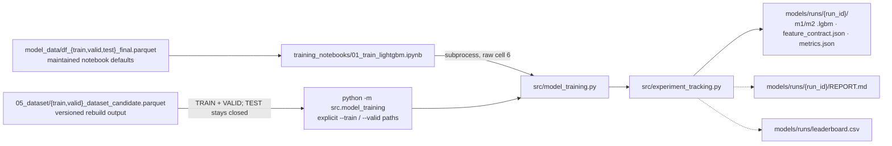

# Stage 4 — training and run records

`05_dataset` → `src/model_training.py` → `src/experiment_tracking.py` → `models/runs/<run_id>/` and `models/runs/leaderboard.csv`.

> [!important] How to read the diagram
> - A **solid** arrow is a current data flow, import, or script-to-script call.
> - A **dashed** arrow ending at a document is a report or output written by that script.

## Route

There are two entrances and one trainer. The notebook resolves its own `TRAIN`/`VALID`/`TEST` from `MODEL_DATA_DIR` defaults and shells out to the module; the controlled August runs invoke the same module directly with explicit versioned `05_dataset` paths. Both converge on `src/model_training.py` and then on `src/experiment_tracking.py`, which is the single writer of run directories and the leaderboard.

The notebook default path is the one affected by the broken maintained route — see `05-off-route`. The controlled runs are not affected, because they never rely on those defaults.

## Stage-to-file navigation

| Step | Entry point or owner | Direct support | Main output |
|---|---|---|---|
| Train and record | `src/model_training.py`; notebook entrance `note_books/training_notebooks/01_train_lightgbm.ipynb` | `src/experiment_tracking.py`, `src/feature_engineering.py`, `src/paths.py`, implicit `src/__init__.py` | `models/runs/<run_id>/*`, `models/runs/leaderboard.csv` |

## Reports produced by this stage

| Producer | Writes |
|---|---|
| `src/experiment_tracking.py` | per-run `models/runs/<run_id>/metrics.json` and `REPORT.md`; appends one row to `models/runs/leaderboard.csv` |

## Evidence anchors

- `note_books/training_notebooks/01_train_lightgbm.ipynb` has 11 cells, 5 of them code. **Raw JSON cell index 6 is the code cell** that builds `[sys.executable, "-m", "src.model_training", "--train", str(TRAIN), "--valid", str(VALID)]` and runs it through `subprocess.run(..., check=True)`. Raw index 10 is a markdown cell describing the CLI alternative, not a code cell.
- Raw cell index 2 of the same notebook imports `MODEL_DATA_DIR` and `MODELS_DIR` from `src/paths.py` and sets `TRAIN`, `VALID`, and `TEST` to `MODEL_DATA_DIR / "df_*_final.parquet"` — these are the maintained-route defaults, not the versioned rebuild paths.
- `src/model_training.py:1570` is the `if __name__ == "__main__": main()` entry that the `-m` invocation reaches.
- `src/experiment_tracking.py:324-332` writes `metrics.json` and then `REPORT.md` into the run's output directory. The leaderboard append near lines 352–360 re-reads the existing header and raises `ValueError` on a header mismatch before appending, so the CSV schema cannot drift silently.
- `leaderboard.csv` carries 12 columns: `run_id`, `case_name`, `created_at`, `n_features`, `m1_valid_auc`, `m1_valid_fail_precision`, `m1_valid_fail_recall`, `m1_valid_fail_f1`, `m2_valid_mae`, `m2_valid_r2`, `baseline_run_id`, `one_line_change`. It does **not** carry feature contract, seed, dataset version, reporting threshold, train–valid gap, or Brier; those live in the per-run `metrics.json` under `run_settings`.
- All 49 leaderboard rows were recomputed against their own `metrics.json`: 49/49 match to 1e-9 on all six metric columns, and every row has a matching run directory.
- `models/runs/` holds 66 directories: 61 run-shaped and 5 aggregate. Twelve run-shaped directories are absent from the leaderboard — 2 empty and 10 pilot evaluations. The group-by-group breakdown is in `docs/manifests/models_runs_index_2026-08.md`.
- All ten 2026-08-06 runs resolve `run_settings.train_path` and `valid_path` to `data/model_data/versions/2026-08_temporal_rebuild_v1/05_dataset/{train,valid}_dataset_candidate.parquet`, and all ten carry `test_policy = closed_not_read`.

---

Previous: [[03-rebuild-2026-08]] · Next: [[05-off-route]] · Per-file detail: [[codebase_map_2026-08]]

