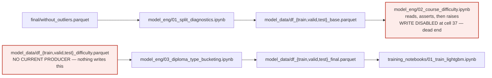

# Stage 5 — off the current route

These files and artifacts belong in the project map, but connecting them to the current training line would incorrectly imply reachability. This document also records one route that *looks* live and is not.

> [!important] How to read the diagram
> - A **solid** arrow is a current data flow, import, or script-to-script call.
> - A **dashed** arrow ending at a document is a report or output written by that script.
> - A **red** node or crossed edge marks a break: something with consumers and no current producer.

## The maintained notebook route is broken

This is the `model_eng` chain that `01_train_lightgbm.ipynb` trains on by default. It cannot currently run end to end.



`02_course_difficulty.ipynb` cell 37 raises

```text
RuntimeError: WRITE DISABLED: this legacy notebook was superseded by
scripts/build_b2_temporal_course_stats.py. Use the versioned B2 builder.
```

before the loop that would write the three difficulty splits. So `data/model_data/df_*_difficulty.parquet` has **no current producer** — yet `03_diploma_type_bucketing.ipynb` still reads those three files and writes `df_*_final.parquet`, which is what `01_train_lightgbm.ipynb` trains on by default. The difficulty splits on disk, if present, are the residue of a run that predates the guard.

**The August controlled runs are unaffected.** They pass explicit `05_dataset` TRAIN and VALID paths and never resolve the `MODEL_DATA_DIR` defaults; all ten 2026-08-06 runs record versioned `05_dataset` paths in `run_settings`. The break is confined to the notebook default entrance.

Recorded here as an observation only. No fix was made and none is proposed.

## An artifact with no producing script

`data/model_data/versions/2026-08_temporal_rebuild_v1/00_preflight/governance_reconciliation_report.md` sits in the preflight output directory, but **nothing in the repository writes it**: a repo-wide grep for `governance_reconciliation` and `reconciliation_report` across every `.py` file returns zero hits, and it is not among the four outputs `rebuild_2026_08_preflight.py` produces. Its own header dates it `2026-08-02` and scopes it to "governance inventory and contradiction scan only".

This is the same shape as the `data/audit/id_dtype_audit/` debris recorded in `docs/manifests/freeze_phase9_2026-07-08.md` §2 — a plausible, apparently hand-produced report whose origin cannot be reconstructed from the tracked tree. Flagged, not touched.

## Report-only and diagnostic tools

Each writes a report for humans and is not part of the trained pipeline.

| File | Writes |
|---|---|
| `scripts/audit_id_columns.py` | `data/audit/id_dtype_audit/id_columns_audit.{csv,json}`, `id_columns_summary.md` |
| `scripts/diagnose_failure_thresholds.py` | `models/diagnostics/<timestamp>__failure-threshold-sweep/` — three CSVs and `REPORT.md` |
| `scripts/diagnose_missed_failures.py` | `models/diagnostics/<timestamp>__missed-fail-analysis/` — one CSV, two JSONs, `REPORT.md` |
| `scripts/difficulty_coverage_diagnostic.py` | `models/runs/DIFFICULTY_COVERAGE_DIAGNOSTIC.{json,md}` |
| `scripts/generate_multiseed_baseline41_vs_concurrent44_report.py` | `models/runs/MULTISEED_BASELINE41_VS_CONCURRENT44_REPORT.{json,md}` |
| `scripts/generate_multiseed_concurrent43_vs_concurrent44_report.py` | `models/runs/MULTISEED_CONCURRENT43_VS_CONCURRENT44_REPORT.{json,md}`; calls `scripts/verify_concurrent_43_vs_concurrent_44.py` |
| `scripts/verify_concurrent_43_vs_concurrent_44.py` | `models/runs/CONCURRENT43_VS_CONCURRENT44_VERIFICATION.json` |
| `scripts/generate_regularization_screening_report.py` | `models/runs/REGULARIZATION_SCREENING_SEED42_REPORT.{json,md}` |
| `scripts/generate_r2_confirmation_report.py` | `models/runs/R2_CONFIRMATION_5SEED_REPORT.{json,md}`; imports the check in `scripts/r2_parity.py` |
| `scripts/r2_coverage_rescore.py` | `models/runs/R2_COVERED_UNCOVERED_FIVE_SEED_REPORT.{json,md}`; imports the same check |
| `scripts/r2_parity.py` | no artifact of its own — returns checks to the two callers above |

## Closed historical branches

| Closed branch | Files | Why it is not connected to current training |
|---|---|---|
| Course-identity investigation | `scripts/course_identity_diagnostic.py`, `course_identity_investigation.py`, `course_identity_reconciliation_2025.py`, `course_identity_67_degree_verification.py` | Produced candidate and review evidence only; no canonical IDs were authorised. |
| Phase 0–2 lineage mapping | `scripts/phase0_evidence_recovery.py`, `phase1_name_key_layer.py`, `phase2_mapping_tables.py`, `phase2_mapping_tables_train_membership.py`, `phase2_mapping_tables_scope_fix.py`, `phase2_link_corrections.py` | `Decisions_Log.md` records `phase_2_decision = NOT_AUTHORISED_BY_OWNER_DESPITE_PROCEED`; the rebuild retains original IDs. |
| Predecessor-prior pilot | `scripts/phase3_predecessor_prior_pilot_build.py`, `..._evaluate.py`, `..._report.py` | Closed pilot with a recorded harmful and non-authorised verdict; its data and ten run directories are not promoted. |
| Governance/migration utilities | `scripts/migrate_legacy_baseline.py`, `scripts/parity_check.py` | One-time migration and completed freeze-parity work, not pipeline entry points. |
| Retired in-place merge | `src/merge_diploma.py` | Raises `RuntimeError` at line 12, before any import or I/O; the maintained owner is `note_books/merge/02_merge_diploma.ipynb`. |

## No confirmed current caller

Each of these was checked by repo-wide grep on both the exact path and the bare module or file stem.

| File | What the census found |
|---|---|
| `scripts/Diagnose concurrent group v2.py` | Executable diagnostic reading the train difficulty split; no caller or importer found. |
| `scripts/show_leaderboard.py` | Prints `models/runs/leaderboard.csv`; no caller or importer found. |
| `src/explain.md` | Unreferenced prose walkthrough of the feature-engineering flow. |
| `src/inference.py` | Loads M1/M2 and difficulty state and scores candidates; called only by `src/recommendation.py` and tests. |
| `src/knn_advisor.py` | Builds and persists a nearest-neighbour index; called only by `src/recommendation.py` and tests. D7 remains HOLD in `docs/data_governance_plan.md`. |
| `src/recommendation.py` | Composes the scorer and KNN evidence; no current pipeline entry point reaches it. |

These three `src/` modules form a plausible post-training recommendation stack, but they call only one another, so nothing on the current route reaches them.

## Evidence anchors

- `02_course_difficulty.ipynb` raw cell index 37 contains the `raise RuntimeError` quoted above, positioned after the column-count assertions and before the `for label, path, df_e in [...]` write loop. The guard text entered the file in commit `decf675`.
- The sibling notebooks were checked for the same pattern and have none: `01_split_diagnostics.ipynb`, `03_diploma_type_bucketing.ipynb`, `explore_outlier_removal.ipynb`, and `02_feature_engineering.ipynb` contain no `raise RuntimeError` in any code cell.
- `03_diploma_type_bucketing.ipynb` cell 6 reads the three `df_*_difficulty.parquet` paths; cell 38 writes the three `df_*_final.parquet` files; cell 40 writes `ARTIFACTS_DIR / 'diploma_type_bucket_map.json'`.
- `01_train_lightgbm.ipynb` raw cell index 2 points `TRAIN`, `VALID`, and `TEST` at `MODEL_DATA_DIR / "df_*_final.parquet"` — the output of the broken chain.
- All ten 2026-08-06 runs record `run_settings.train_path` and `valid_path` under `versions/2026-08_temporal_rebuild_v1/05_dataset/`, which is why they are unaffected.
- `phase_2_decision = NOT_AUTHORISED_BY_OWNER_DESPITE_PROCEED` appears verbatim in `Decisions_Log.md` at lines 1471 and 1567.
- `src/merge_diploma.py` raises before its own imports; the docstring names governance decision D1 and points at `note_books/merge/02_merge_diploma.ipynb` as the maintained owner.

---

Previous: [[04-training-and-runs]] · Per-file detail: [[codebase_map_2026-08]]

